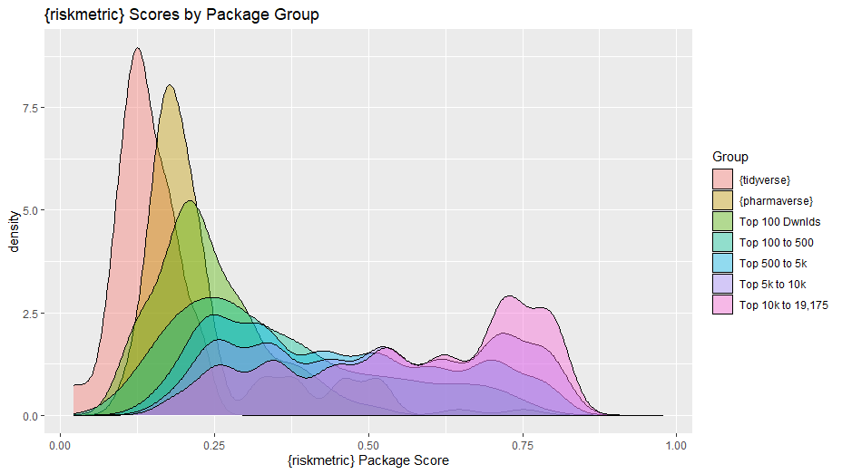
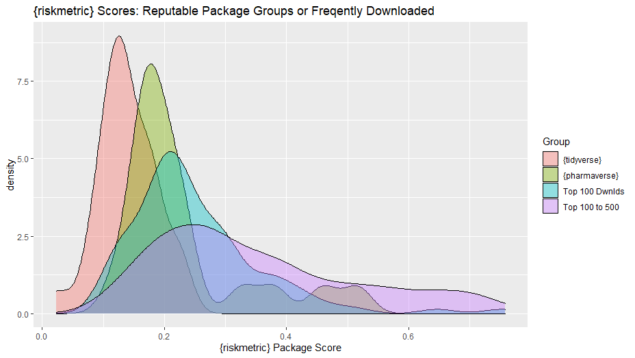
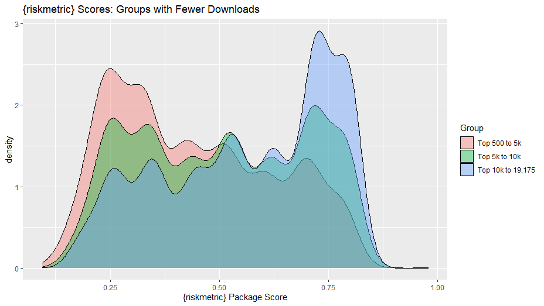

```{r xaringanExtra, echo=FALSE, include=FALSE}
xaringanExtra::use_xaringan_extra(c(
  "tile_view", 
  "animate_css", 
  "scribble", 
  "search", 
  "webcam", 
  "clipboard", 
  "fit_screen", 
  "tachyons", 
  "editable"
)) 

xaringanExtra::use_extra_styles(
  hover_code_line = TRUE,         #<<
  mute_unhighlighted_code = TRUE  #<<
)
```

```{r startup, include=FALSE, message=FALSE, warning=FALSE, cache=TRUE}
```

layout: false
class: title-slide, inverse, middle, main_slide
name: title-slide

```{r xaringan-logo, echo=FALSE}
xaringanExtra::use_logo(
  image_url = "https://raw.githubusercontent.com/pharmaR/pharmaR.github.io/preview/static/img/banners/pharmaRlogo.png",
  height = "15%",
  width = "20%",
  position = xaringanExtra::css_position(top = "85%"),
  exclude_class = c("title-slide", "inverse", "hide_logo")
)
```

# Learnings & Reflection from Case Studies
### What's next for the R Validation Hub
## [Community Meeting 2023-06-27](https://github.com/pharmaR/events/tree/main/community_meetings/2023-06-27)


Juliane Manitz, Doug Kelkhoff, Andy Nicholls, Lyn Taylor, Joseph Rickert, Paulo Bargo, Keaven Anderson, Eric Milliman, Aaron Clark and Preetham Palukuru

...on behalf of the R Validation Hub, an R Consortium-funded ISC Working Group


---

class: inverse, middle
# Agenda

1. R Validation Hub Updates

2. Recap Case Studies

3. Discussion Rounds

  - Package score thresholds (low, medium, or high vs accepted/rejected) and metric weights 
  
  - Repository for common packages and their metrics 
  
  - Sharing test data and test cases
  
  - Ensuring and documenting R package reviewers have the right technical expertise

---
# R Validation Hub Updates

* Passing the baton. Doug taking over for Andy in the lead role. 

--

* Team Survey
  - felt we were doing well to deliver technical products 
  - but want to renew our focus on planning and communication

--

* Calls for Volunteers!
  - Growing a Communications workstream (improving consistency of branding, channels of communication, year-long planning)
  - Building a network of leadership sponsors

--

* Advanced Notice: Upcoming Events
  - R/Pharma summit at `posit::conf` (Sept 18)
  - R/Pharma 2023 (Oct 24-26)

---
class: inverse, center, middle
# Case Studies Recap

https://github.com/pharmaR/case_studies 


---
# Case Studies

* R validation hub initiated a three-part presentation series on “case studies” 

--

* Eight pharma companies participated a case series sharing different experiences on building a GxP framework with R 

--

* Highlight aspects that were easy to implement which those which were more challenging. 

--

* Recordings of these sessions are available on the R Validation minutes page.

--

* Discussion and exchange to be continued on GitHub, where you are welcome to contribute and learn from others.

---
# Case Studies: Common Themes

* All implementations follow the risk validation process for R packages as outlined in the white paper
Classification of package quality into high/medium/low or a binary high/low categorization, however the approach to the assessments themselves varies.

--

* High importance of test coverage as assessment metric 

--

* Trusted resources: R Foundation, thus core R (base and recommended packages) are treated as a collective of “low risk” packages; some organizations also trust Rstudio developments, i.e. tidyverse, etc.

--

* The majority focused risk assessments only on “Intended-for-Use” packages but several also ran metrics on the Imports.


---
# Case Studies: Differences in Approach

* Varied degrees of automation in risk classification and qualification i.e. either complete automation or no automation

--

* Different weights were assigned to the testing coverage and various suggested metadata metrics: acceptable threshold for test coverage ranges between 50-80% for low-risk packages

--

* Different risk remediation strategies have been applied:

  - some organizations will immediately introduce their own unit tests, 
  
--

  - others restrict package use to only the tested subset of package functionality.

---
# Case Studies: Shared Challenges

* R package assessment is a resource-intense activity

  - Time has proven to be a considerable challenge. 
  
--

  - Ensuring R package reviewers have the right technical expertise 
  
--

  - Alignment of different  contributors across the organization: IT, Quality Assurance and with their own Statistics, Data Science, or Programming lines.
  
--

* Finding appropriate test datasets, test cases and expected model output

--

* Long-term management and maintenance as well as oversight of the risk-based package assessment process


---
class: inverse, middle
# Discussion Rounds

* Package score thresholds (low, medium, or high vs accepted/rejected) and metric weights [Aaron]

* Repository for common packages and their metrics [Coline]

* Sharing test data and test cases [Juliane]

* Ensuring and documenting R package reviewers have the right technical expertise [Preetham]

---
# Discussion Rounds (1/4 with _Aaron_)

## Package risk scores & metric weights!

--


Let's back up first! 


* What is `{riskmetric}`?

--

<br>

**Question for the chat:**

To what extent have you (or your organization) used `{riskmetric}`?
* a. Never used it, and don't plan to
* b. We're considering using it, but haven't gotten very far
* c. Played with it a bit, but we don't use it formally. We came up with our own method that is...
  * c1: similar or borrows ideas from `{riskmetric}`
  * c2: nothing like `{riskmetric}`
* d. We use components or all of `{riskmetric}` in our R-package validation process


---

# Package scores!

Discussion: How do you feel about **risk scores?** Are they integral to your review process? Do you even care about them? Enter **"Care"** / **"Don't Care"** in the chat!

--

Through our case study work, we've seen many leverage the **low, medium, or high** risk categories. We enhanced the `{riskassessment}` app to allow users to set "risk decision thresholds" automatically, tagging packages based on pkg score:


---
## Package scores! (cont'd)


So the big question is:

* How high is **too high**? Put it in the chat!

--

Ultimately, it's up to you. But it'd be nice to have some of consensus. Here is some data to help us make these decisions...


---
## We scored all of CRAN (19,715 pkgs)




---
## Pkg Groups and Highly Downloaded




---
## Groups with fewer downloads

<!--  -->


---
### Package Weights!

a: **news_current**: News file has an entry for the current version of the package.<br>
b: **has_vignettes**: package contains vignettes.<br>
c: **size_codebase**: a logistic rating of the number of lines of code in the package.<br>
d: **has_bug_reports_url**:  package links to a location to file bug reports.<br>
e: **bugs_status**:  fraction of the last 30 bugs which have been closed.<br>
f: **license**: the package ships with an acceptable license.<br>
g: **export_help**: fraction of exported objects that are documented.<br>
h: **reverse_dependencies**: (log10) number of packages that depend on this package.<br>
i: **downloads_1yr**: logistic rating of the number of package downloads in the past year.<br>
j: **dependencies**:  number of package dependencies.<br>
k: **has_website**: package has an accompanying website.<br>
l: **r_cmd_check**: weighted sum of errors/warnings/notes from R CMD Check.<br>
m: **remote_checks**: weighted sum of OS flavor R CMD check results.<br>
n: **has_maintainer**:  package has a maintainer.<br>
o: **exported_namespace**:  fraction of exported objects that are documented.<br>
p: **has_news**:  package has a NEWS file.<br>
q: **has_source_control**: package has an associated version-controlled repository.<br>
r: **covr_coverage**: fraction of lines of code which are covered by a unit test.<br>

In the chat - say **'up-weight covr_coverage'** or 'up-weight r' or to up-weight or down-weight a metric! 


---
# Do you want scoring data for CRAN?

If you complete our survey, I'll send the data (and code to reproduce my analysis). Of course, you could write a script to do it yourself. But it took 10 hours to run on my laptop, so taking a 10-minute survey would be waaaay easier!


<a href='https://bit.ly/risk_survey'></a>


--

#### Stay tuned...

* Presentation @ userR! Conf 2023 in Basel, Switzerland

* Full deployment of `{riskassessment}` app with top 1k downloaded CRAN pkgs uploaded for companies to collaborate on


---
# Discussion Rounds (2/4 with _Coline_)

## Repository for common packages and their metrics

* Does a "one-stop-shop" repository for packages resolve pharma challenges? If 
  not, what is missing?

* Beyond just fetching packages, what are we lacking for building trust?

* How are _opinions_ of packages shared?

* Unit testing is great for development, but is it right for quality assessment? 
  Do we need something more?

* If evidence of quality is shown in a standard comput environment (ie, a
  rockerverse image), what remaining gaps might prevent immediate company
  adoption?

---
# Discussion Rounds (3/4 with _Juliane_)

## Sharing test data and test cases 

* Do you use the CDISC data? 

* Do you use example data from standard statistical textbooks? 

* Do you share observed differences in implementations at CAMIS [(Comparing Analysis Method Implementations in Software)](https://psiaims.github.io/CAMIS/)

* How do we channel test cases back to package developer? 

---
# Discussion Rounds (4/4 with _Preetham_)

## Ensuring and documenting R package reviewers have the right technical expertise

* Who reviews R packages? What is the role of software engineers, statisticians,
  clinical experts?

* How do we reconcile different interpretations of package quality when viewed
  from these different roles?

* What can the R Validation Hub do to elevate discussions beyond pure code
  quality?

