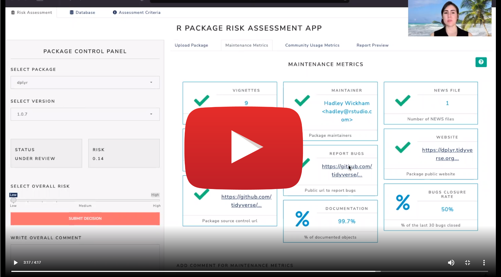

```{r, include = FALSE}
knitr::opts_chunk$set(
  collapse = TRUE,
  comment = "#>",
  fig.path = "figures/README-",
  out.width = "100%"
)
```

# `{riskassessment}` app @ shinyConf 2023 <a href='https://bit.ly/raa_docs'></a>


## Abstract

Building an analysis pipeline can be hard. Especially when it relies on seemingly obscure packages that perform much-needed tasks. Without re-inventing the wheel or painstakingly browsing the source code, how can a programmer get a high-level overview of an R package’s integrity or trustworthiness? After all, the last thing anyone wants is to adopt a package that later pushes unannounced breaking changes, or worse – was written by an un-responsive author who has abandoned their code.

Enter the `{riskassessment}` app, an open-source front-end to the `{riskmetric}` package. `{riskmetric}` provides a framework to quantify risk via metrics that evaluate package dev best practices, code documentation, community engagement, and sustainability. The app aims to be a platform for quality assessment within organizations that operate in regulated industries but can be leveraged in various contexts. This presentation will teach you how to leverage `{riskassessment}` to evaluate your R package line up and discuss where development is heading in the future.

## Presentation Materials / Links

<br>

<center>
<a href="https://bit.ly/demo_raa">

</a>
</center>

<br>

<br>

<a href='https://bit.ly/raa_docs'></a>


<a href='https://bit.ly/raa_survey'></a>

## Presentation

If you want a quick tour through the app (or need assistance getting past the authentication wall), you should watch this short walk through on the R Consortium's website:

<br>

<center>
<a href="https://www.r-consortium.org/blog/2022/02/03/risk-assessment-shiny-app-update-from-r-validation-hub">

</a>
</center>


<br>


