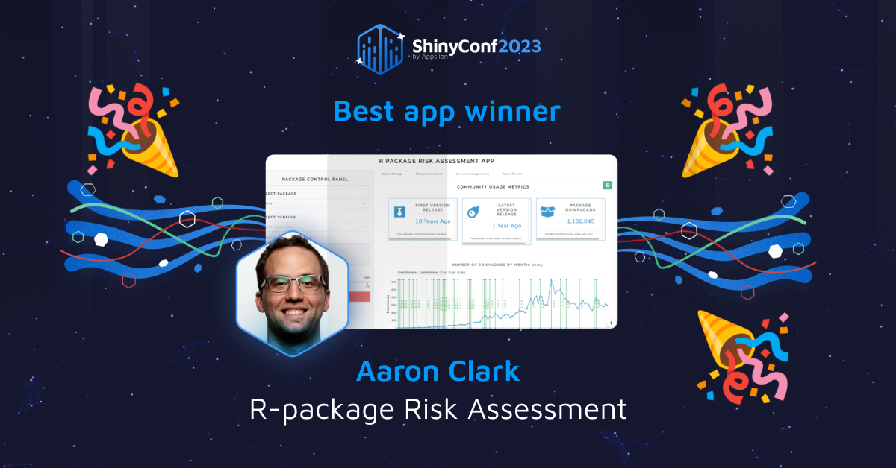
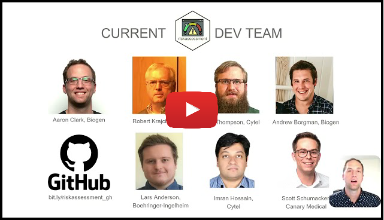

```{r, include = FALSE}
knitr::opts_chunk$set(
  collapse = TRUE,
  comment = "#>",
  fig.path = "figures/README-",
  out.width = "100%"
)
```

# `{riskassessment}` app @ shinyConf 2023 <a href='https://bit.ly/raa_docs'></a>

<br>

March 15 - 17, Appsilon hosted the [2nd Annual Shiny Conference](https://shinyconf.appsilon.com/) which was fully virtual with approximately 4k registrants. The conference also had a dedicated [slack channel](https://app.slack.com/client/T04PB2RNVGE/C04PB2RQBUN) for questions and communication (outside of the hopin platform).

Aaron Clark, from the R Validation Hub Executive Committee, submitted the following abstract along with the `{riskassessment}` application work, featured in the "Shiny Showcase". His talk was available on demand through all three days of the conference and was voted "favorite Shiny App" by conference attendees.

<br>


<center>

</center>


## Abstract

Building an analysis pipeline can be hard. Especially when it relies on seemingly obscure packages that perform much-needed tasks. Without re-inventing the wheel or painstakingly browsing the source code, how can a programmer get a high-level overview of an R package’s integrity or trustworthiness? After all, the last thing anyone wants is to adopt a package that later pushes unannounced breaking changes, or worse – was written by an un-responsive author who has abandoned their code.

Enter the `{riskassessment}` app, an open-source front-end to the `{riskmetric}` package. `{riskmetric}` provides a framework to quantify risk via metrics that evaluate package dev best practices, code documentation, community engagement, and sustainability. The app aims to be a platform for quality assessment within organizations that operate in regulated industries but can be leveraged in various contexts. This presentation will teach you how to leverage `{riskassessment}` to evaluate your R package line up and discuss where development is heading in the future.

<br>


## Presentation

The talk is currently available on [Appsilon's youtube channel](https://bit.ly/raa_shinyconf23). The first half provides a high level overview that introduces the audience to the work and the second half gives a hands-on demo:

<br>

<center>
<a href="https://bit.ly/raa_shinyconf23">

</a>
</center>


<br>

<br>

## Presentation Materials / Links

Click any of the images below to checkout a few different resources presented in the demonstration:

1. The [demo version](https://bit.ly/demo_raa) of the app, deployed on shinyapps.io
1. App [User guide](https://bit.ly/raa_docs)
1. A [Google Form](https://bit.ly/raa_survey) that discerns whether attendees are actual users or `{riskmetric}` and/or `{riskassessment}`, and if so, asks whether we can connect in the future to solicite feedback
1. PDF [slides](https://github.com/pharmaR/conferences/shinyConf_2023/riskassessment_ClarkAaron_shinyConf2023.pdf)

<br>


```{css, echo=FALSE}
.clearfix:after {
  content:"";
  display:block;
  clear:both;
 }
```


<center>
<a href="https://bit.ly/demo_raa"></a>

<br>

<br>

<div class = "clearfix">
<a href='https://bit.ly/raa_docs'></a>

<a href='https://bit.ly/raa_survey'></a>

<a href='https://github.com/pharmaR/conferences/shinyConf_2023/riskassessment_ClarkAaron_shinyConf2023.pdf'></a>
</div>
</center>


<br>

<br>

With any questions, please reach out to Aaron Clark (clark.aaronchris@gmail.com). Enjoy!

<br>

<br>

<br>

<br>

<br>

<br>

<br>


