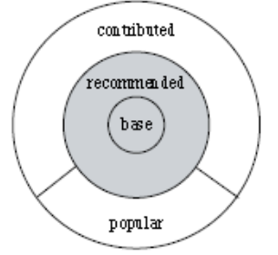
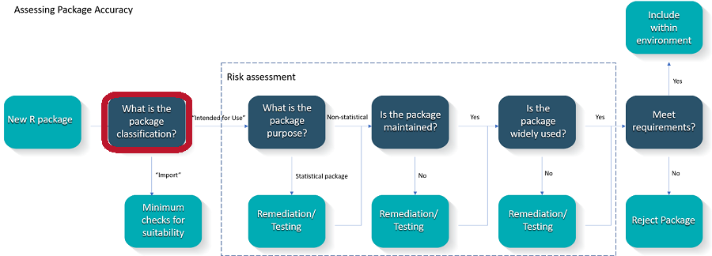
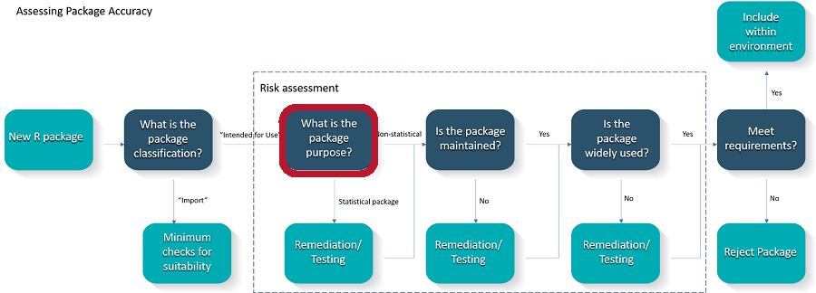
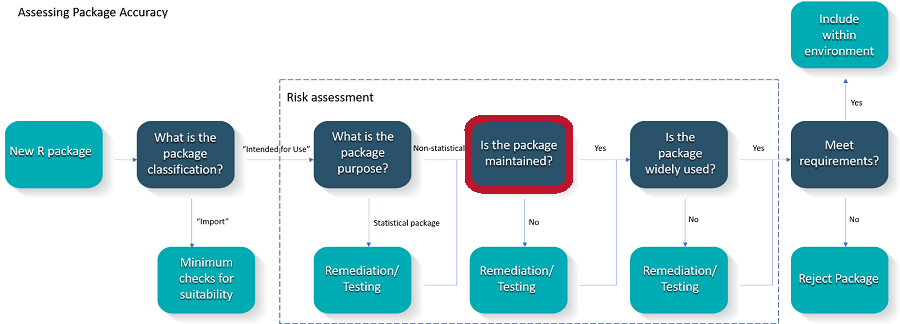
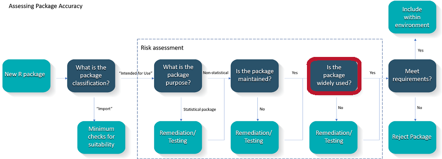
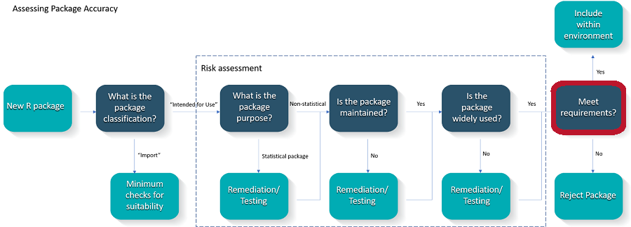
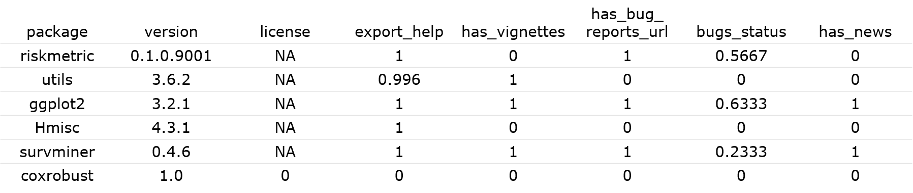

```{r setup, include=FALSE}
knitr::opts_chunk$set(echo = TRUE)

require(dplyr)
```

<style>
div.footnotes {
  position: absolute;
  bottom: 0;
  left: 180px;
  margin-bottom: 10px;
  width: 70%;
  font-size: 0.6em;
}
</style>

<script src="https://ajax.googleapis.com/ajax/libs/jquery/3.1.1/jquery.min.js"></script>
<script>
$(document).ready(function() {
  $('slide:not(.backdrop):not(.title-slide)').append('<div class=\"footnotes\">');

  $('footnote').each(function(index) {
    var text  = $(this).html();
    var fnNum = (index+1).toString();
    $(this).html(fnNum.sup());

    var footnote   = fnNum + '. ' + text + '<br/>';
    var oldContent = $(this).parents('slide').children('div.footnotes').html();
    var newContent = oldContent + footnote;
    $(this).parents('slide').children('div.footnotes').html(newContent);
  });
});
</script>

## Abstract 


<font size="4"><p style="line-height:0.8">
This contribution has the aim to discuss possible risk-based approaches to assess R package accuracy within a validated infrastructure. Ideas and suggestions reflect current thinking of the R Validation Hub working group, which is a cross-industry initiative funded by the R Consortium. Our mission is to enable the use of R by the bio-pharmaceutical industry in a regulatory setting, where the output may be used in submissions to regulatory agencies. In this setting, R is required to be part of a validated system, which encompasses software accuracy, reproducibility and traceability. We differentiate two types of R packages: Core and recommended packages are shipped with the basic installation. A rigorous software development lifecycle assures minimal risk. However, contributed packages may vary in their accuracy and development rigor, which could be assessed by various metrics. This cross-industry WG suggested several relevant quality metrics, and is developing an R package that provides a workflow to evaluate the quality of a set of R packages. This work may also be relevant in other regulated areas such as financial service industries and agriculture.
</font></p>

*Accepted for presentation at useR! 2020*

## R Validation Hub


- R Consortium Working Group
- approx. 100 members; > 50 organizations

> **Mission:** R Validation Hub is a cross-industry initiative whose mission is to enable the use of R by the Bio-Pharmaceutical Industry in a regulatory setting, where the output may be used in submissions to regulatory agencies.

## Resources


Website [www.pharmaR.org](https://www.pharmaR.org/)

+ Blog posts
+ Presentations
+ White paper

Tools available on [GitHub](https://github.com/pharmaR/riskmetric) 

+ R Package `riskmetric`
+ Risk Assessment App

## Regulations


>- ICH.<footnote>: The International Council for Harmonisation of Technical Requirements for Pharmaceuticals for Human Use </footnote> 
“...software used should be reliable, and documentation of appropriate software testing procedures should be available”
>- FDA.<footnote> US Food and Drug Administration: Glossary of Computer System Software Development Terminology</footnote> <!--  -->
"Validation [...] provides a high degree of *assurance* that a specific process *consistently* produces a product meeting its *predetermined specifications* and quality attributes."


## Validating `R`


:::: {style="display: flex;"}

::: {}
>- *Core R*, base and recommended packages, owned by the R Foundation
>- *Contributed R packages* from the community: Different owners, varying quality, many are essential to make good use of R
:::

::: {}
 {width=300px}
:::
::::

## Core R


<!--R is proposed to be used in the same way that we currently use SAS
 SAS is generally a trusted vendor
  We trust their SDLC
  We also trust their installation tests 
  We trust that the underlying procedures do what they’re supposed to -->

- The R Foundation follows many good practices during the SDLC of core R.<footnote>Software Development Life Cycle: A Description of R’s Development, Testing, Release and Maintenance Processes</footnote>

- Statement on Regulatory Compliance and Validation Issues.<footnote>Regulatory Compliance and Validation Issues: A Guidance Document for the Use of R in Regulated Clinical Trial Environments (2018)</footnote>

>- **It can be concluded that there is minimal risk in using Core R for regulatory analysis and reporting**

## Contributed Packages


Intent-to-use package or indirect import?

{width=800px}

## Contributed Packages


Is a statistical method implemented?

{width=800px}

## Contributed Packages


Are good maintance practice fulfilled?

{width=800px}

## Contributed Packages


What is the community usage and testing?

{width=800px}

## Contributed Packages


Submission-relevant or explorative analysis?

{width=800px}


## R Package `riskmetric`


``` {r, eval=FALSE}
library(riskmetric) 
pkg_tbl <- pkg_ref(c("riskmetric", "utils", 
                    "ggplot2", "Hmisc", 
                    "survminer", "coxrobust")) 
res <- pkg_tbl %>%
  pkg_assess() %>%
  pkg_score() %>%
  mutate(risk = summarize_scores(.))
```

{width=800px}

## Summary 


``` {r, fig.align = 'center', echo=FALSE,  out.width="80%"}
knitr::include_graphics("img/pharma.png") 
```

# Thanks for your Interest! 
